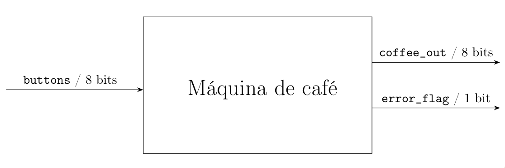

# Implementação de máquina de café em VHDL

## Descrição do projeto

A entidade `coffee_machine` recebe uma entrada `buttons` de 8 bits procura por duplicatas e gera a saída `coffee_out` de 8 bits, que representa as saídas de café. Além disso, há mais uma saída que representa um error ao processar a entrada, isto é, mais de um ou nenhum botão pressionado ao mesmo tempo.

## Tabela verdade

Seu comportamento é especificado por essa tabela.

| **Entrada (`buttons`)** | **Saída (`coffe_out`)** | **Erro (`error_flag`)** | **Descrição**                    |
| ----------------------- | ----------------------- | ----------------------- | -------------------------------- |
| `0000 0000`             | `0000 0000`             | `1`                     | Nenhum botão pressionado (erro). |
| `0000 0001`             | `0000 0001`             | `0`                     | Botão 0 pressionado. Café 0.     |
| `0000 0010`             | `0000 0010`             | `0`                     | Botão 1 pressionado. Café 1.     |
| `0000 0100`             | `0000 0100`             | `0`                     | Botão 2 pressionado. Café 2.     |
| `0000 1000`             | `0000 1000`             | `0`                     | Botão 3 pressionado. Café 3.     |
| `0001 0000`             | `0001 0000`             | `0`                     | Botão 4 pressionado. Café 4.     |
| `0010 0000`             | `0010 0000`             | `0`                     | Botão 5 pressionado. Café 5.     |
| `0100 0000`             | `0100 0000`             | `0`                     | Botão 6 pressionado. Café 6.     |
| `1000 0000`             | `1000 0000`             | `0`                     | Botão 7 pressionado. Café 7.     |
| `XXXX XXXX`             | `0000 0000`             | `1`                     | Qualquer outra entrada (erro).   |

## Plano de simulação e Simulação

Para assertar o funcionamento da nossa implementação, vamos testar as seguintes entradas:

### Cenários de Teste para a Entidade `coffe_machine`

| **Caso de Teste** | **Entrada (`buttons`)** | **Saída Esperada (`coffe_out`)** | **Erro (`error_flag`)** | **Descrição**                                   |
| ----------------- | ----------------------- | -------------------------------- | ----------------------- | ----------------------------------------------- |
| **Teste 1**       | `0000 0100`             | `0000 0100`                      | `0`                     | Apenas o botão 2 foi pressionado. Café 2.       |
| **Teste 2**       | `1000 0000`             | `1000 0000`                      | `0`                     | Apenas o botão 7 foi pressionado. Café 7.       |
| **Teste 3**       | `0000 0000`             | `0000 0000`                      | `1`                     | Nenhum botão foi pressionado. Erro.             |
| **Teste 4**       | `0000 1110`             | `0000 0000`                      | `1`                     | Mais de um botão pressionado (botões 1, 2 e 3). |
