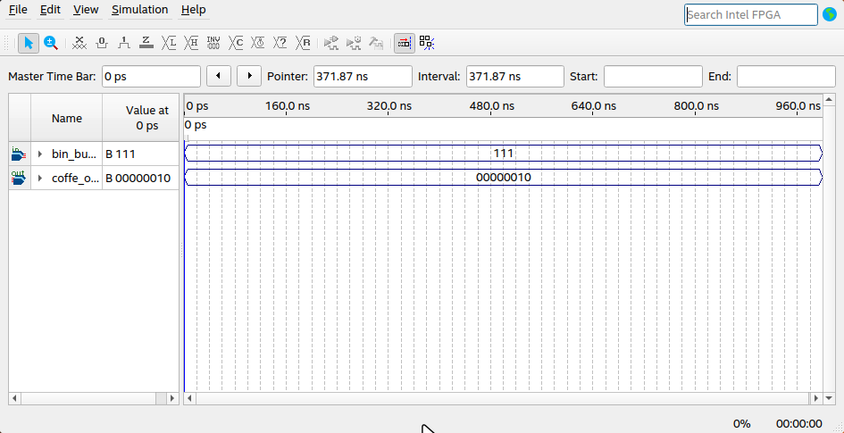
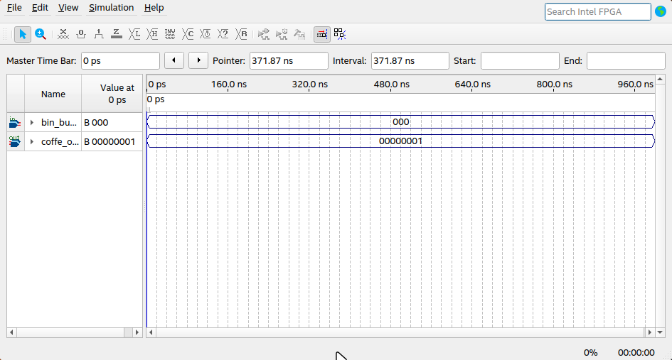
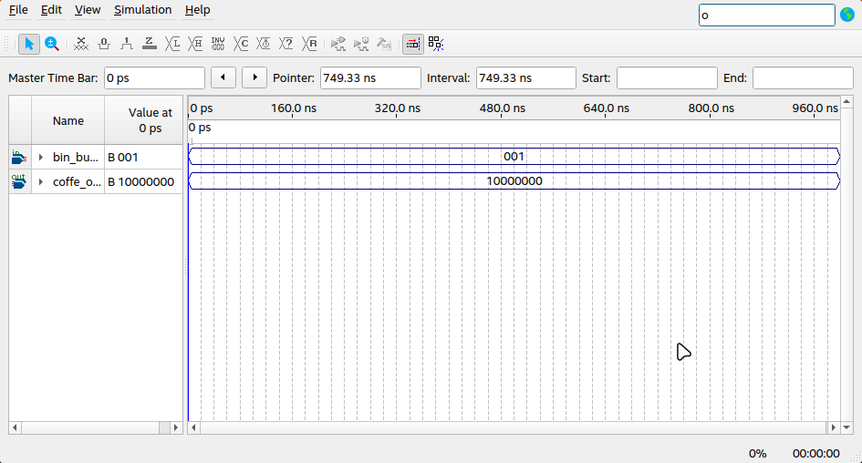

# Implementação de máquina de café em VHDL

Para esse projeto vamos usar usar o circuito combinacional **Decodificador**,
visto que precisamos transformar um código binário (descrição do botão) em um
conjunto de sinais de saída, onde um sinal é ativado por vez (saída do café).

Para alcançar tal objetivo, vamos usar dois `std_logic_vector`, um de tamanho 3
para lidar com as codificações dos botões e outro de tamanho 8 para representar
a saída da cafeteira. Portanto:

```vhd
library ieee;
use ieee.std_logic_1164.all;
use ieee.numeric_std.all;

entity coffe_machine is
 port (
  bin_buttons : in std_logic_vector(0 to 2);
  coffe_out   : out std_logic_vector(0 to 7)
 );
end entity coffe_machine;
```

Note que cada codificação do botão é um número binário que tem representação
de 0 a 7. Como, a codificação do botão é ordem correspondente com a representação
alfabética dos botões, podemos simplesmente converter o binário em decimal e ativar
a saída correspondente a posição encontrada após a conversão.

```vhd
architecture Behavioral of coffe_machine is
begin

 process(bin_buttons)
 begin
  coffe_out <= (others => '0');
  if bin_buttons = "000" then --- Saída H (7) para o botão 8 (000)
   coffe_out(7) <= '1';
  else
   coffe_out(to_integer(unsigned(bin_buttons)) - 1) <= '1'; -- 001 (bin) → 1 (decimal), mas posição 0
  end if;
 end process;

end architecture Behavioral;
```

Se atentando ao indexamento dos bits que começa em 0, finalizamos a nossa implementação
da máquina de café.

## Plano de simulação e Simulação

Para assertar o funcionamento da nossa implementação, vamos testar apenas o botão 7
representado por "111", o botão 8 ("000") e o botão 1 ("001").

- **Botão 7**:



- **Botão 8**:



- **Botão 1**:


