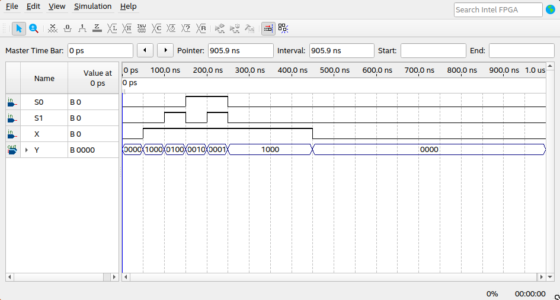
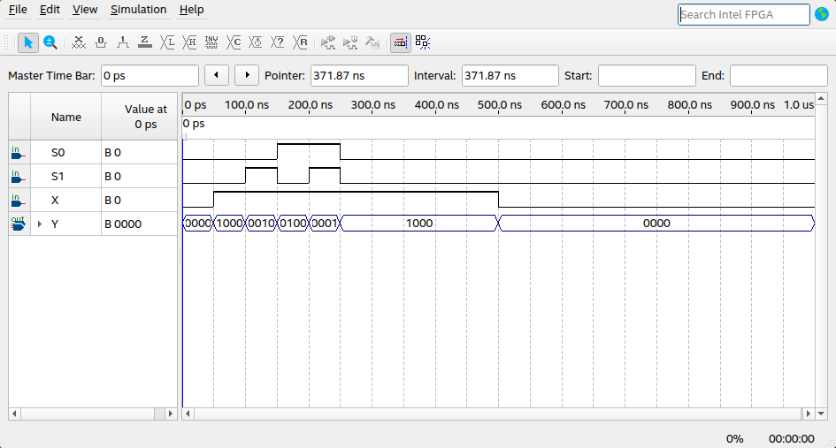
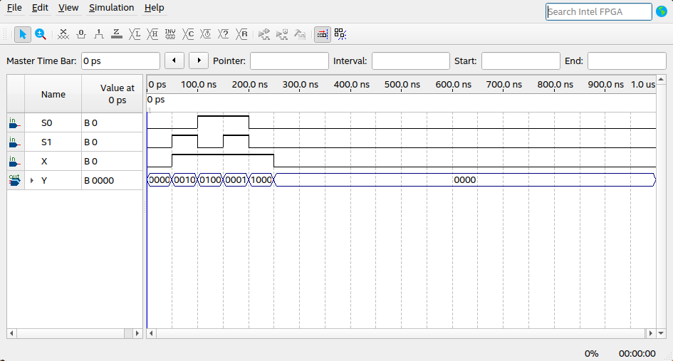
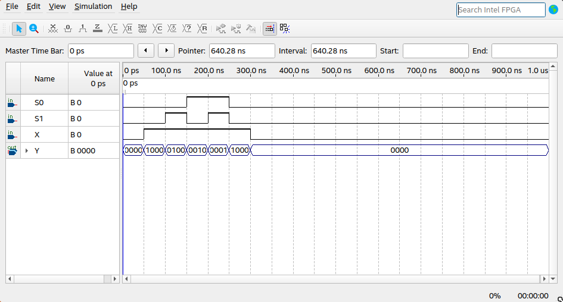

# Implementação Demux 1x4 em versões concorrentes e sequenciais

## Demux 1x4

Um demux 1x4, nada mais é que um circuito combinacional que possui uma 1 entrada e distribui o sinal para 4 saídas, tal comportamento é possível devido ao uso de seletores, que são $\log_2$ o número de saídas.

Para esse projeto, o comportamento esperado para o demux nas 3 implementações é (if-else, when-else, when-select, case-when) é:

| X   | S0  | S1  | Saída Y |
| --- | --- | --- | ------- |
| 1   | 0   | 0   | 1000    |
| 1   | 0   | 1   | 0100    |
| 1   | 1   | 0   | 0010    |
| 1   | 1   | 1   | 0001    |
| 0   | \*  | \*  | 0000    |

### Plano de simulação

Uma vez estabelecido o comportamento esperado, testaremos a implementação em todos os casos da tabela. Começando pela simulações da implementação com **When-Select** teremos:

## Versões concorrentes

### When-Select

Conforme esperado, o circuito se comportou adequadamente.

### When-Else

Continuando, com o **When-else** teremos o mesmo resultado.

Novamente, o programa agiu como o esperado.

## Versões sequenciais

Para as versões sequências teremos resultados análogos obviamente.

### If-Else

### Case-When

Por fim, temos a implementação com o case.

Novamente, conforme o esperado.
