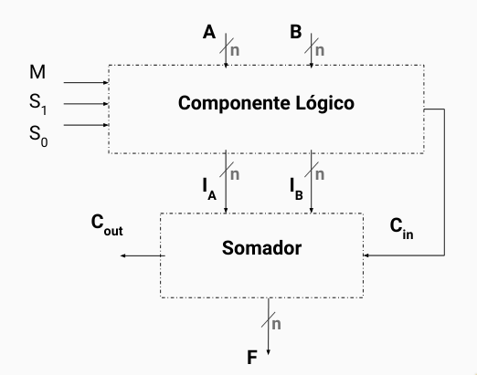

# ULA de 16 bits

O diagrama de blocos da implementação da nossa ULA é idêntico ao apresentado no slide de referência da disciplina, este é:

A única diferença notável é a nomeação de algumas variáveis que serão esclarecidas em seguida nesse documento.

## Tabela verdade do componente lógico

| M   | S1  | S0  | Operação            | Ia                   | Ib              | Cin |
| --- | --- | --- | ------------------- | -------------------- | --------------- | --- |
| $0$ | $0$ | $0$ | $A + B$             | $A$                  | $B$             | $0$ |
| $0$ | $0$ | $1$ | $A - B$             | $A$                  | $\overline{B}$  | $1$ |
| $0$ | $1$ | $0$ | $A << 1$            | A(14 downto 0) & '0' | (others => '0') | $0$ |
| $0$ | $1$ | $1$ | $A >> 1$            | '0'& A(14 downto 0)  | (others => '0') | $0$ |
| $1$ | $0$ | $0$ | $A \land B$         | $A \land B$          | (others => '0') | $0$ |
| $1$ | $0$ | $1$ | $A \lor B$          | $A \lor B$           | (others => '0') | $0$ |
| $1$ | $1$ | $0$ | $A \oplus B$        | $A \oplus B$         | (others => '0') | $0$ |
| $1$ | $1$ | $1$ | $A \text{ XNOR } B$ | $A \text{ XNOR } B$  | (others => '0') | $0$ |

## Expressões de entrada do somador

O nosso somador de 16 bit é implementado a partir de vários somadores de 1 bit, tal somador tem as seguintes entradas e saídas:

- Entradas:
  - $\texttt{A}$: bit do operando $A$.
  - $\texttt{B}$: bit do operando $B$.
  - $\texttt{Cin}$ carry-in (bit de transporte da última posição).
- Saídas:
  - $\texttt{Result}$: soma dos bits $\texttt{A},\texttt{B} \text{ e }\texttt{Cin}$.
  - $\texttt{Cout}$: carry-out (bit de tranporte para a próxima posição).

#### Expressões lógicas

Além disso, as expressões das saídas do somador de 1 bit são:

- **Soma**

$$
F = A \oplus B \oplus \texttt{Cin}
$$

- **Carry-out**:

$$
\texttt{Cout} = (A \cdot B) + (\texttt{Cin} \cdot (A \oplus B))
$$

#### Mapa de karnaugh para as saídas

- **Para $F$ $\texttt{(Result)}$:**

  O mapa de karnaugh de $F$ para as combinações das entraddas $A,B \text{ e } \texttt{Cin}$ é:

  | $A \setminus B,\texttt{Cin}$ | 00  | 01  | 11  | 10  |
  | ---------------------------- | --- | --- | --- | --- |
  | 0                            | 0   | 1   | 0   | 1   |
  | 1                            | 1   | 0   | 1   | 0   |

- **Para $\texttt{Cout}$:**

  E por fim, o mapa de karnaugh para $\texttt{Cout}$ com as combinações das entradas $A,B, \text{ e } \texttt{Cin}$ é:

  | $A \setminus B,\texttt{Cin}$ | 00  | 01  | 11  | 10  |
  | ---------------------------- | --- | --- | --- | --- |
  | 0                            | 0   | 0   | 1   | 0   |
  | 1                            | 0   | 1   | 1   | 1   |

### Somador 16 bits

Uma vez definido o funcionamento do somador de 1 bit, implementamos o somador de 16 utilizando a propagação de carry, isto é:

- Cada carry $\texttt{(Cout)}$ é passado como $\texttt{Cin}$ para o próximo somador de 1 bit.
- O resultador $\texttt{(Result)}$ é calculado bit a bit usando os somadores de 1 bit.
